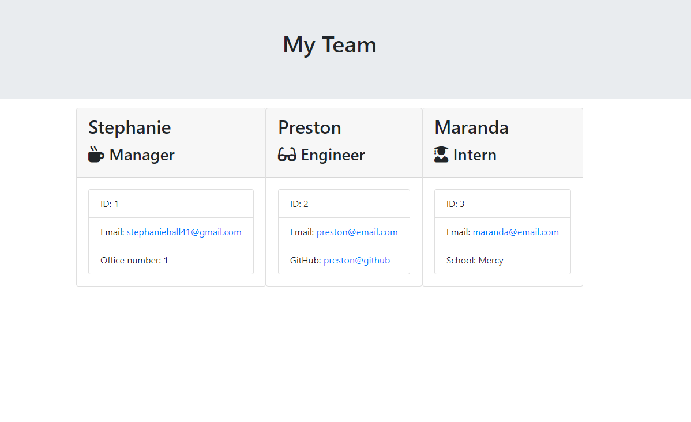

# OOP-Template-Engine-Employee-Summary

## Description

This application uses Node coupled with CLI to gather user provided information about employees for an engineering team and generates an HTML webpage that displays summaries for each employee.

## Table of Contents

* [Installation](#installation)
* [License](#license)
* [Tests](#tests)

## Installation

This application uses Jest to test code and Inquierer to prompt user to gather data. Simply run the following to gather dependencies:
> npm install

To initiate your application, you will need to enter the following command:
> node app.js

## License

## Tests

To execute tests the user must execute the following command:
> npm run test

## Input

## Output

